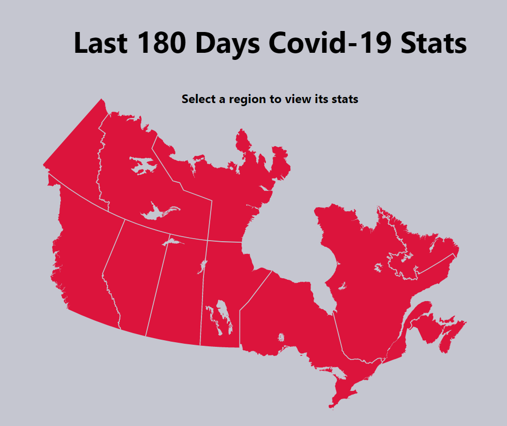

# Canada Covid Stats

An interactive map that displays basic stats of each province/territory from the last 180 days

## Features
- Clicking on a region to display stats of that region
- Graph of stats from the last 180 days
- Compare the graphs of two regions

## Demo
[Click here to visit the demo site](https://canada-covid.herokuapp.com/)

## Technology
- React
- [Disease.sh API](https://disease.sh/)
- [React Canada Map ](https://www.npmjs.com/package/react-canada-map)